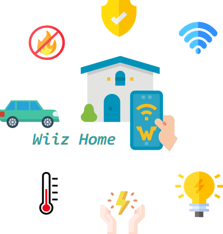

# Homatic: Automação Residencial Customizada - Aplicação mobile e webserver construida em ESP32

## **Clique na imagem para conhecer o projeto**

 
 
 
 
# Stop, Think & Go: Sistema Semafórico Automatizado
## **Clique na imagem para conhecer o projeto**

 
 
 
 
## Wiiz Home: Automação Residencial Geral
## **Clique na imagem para conhecer o projeto**

