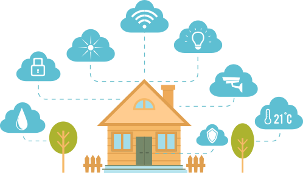
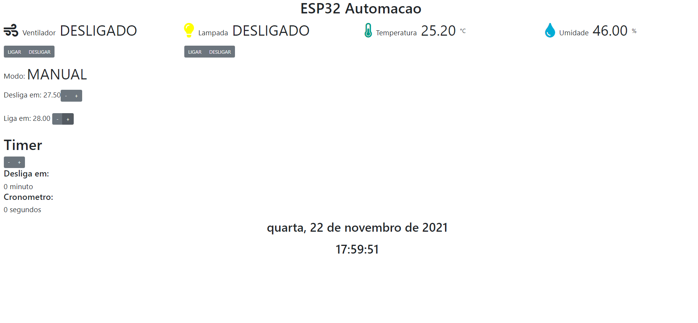
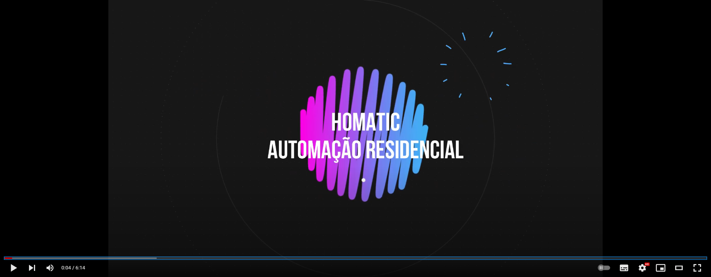

# Homatic - Automação Residencial via IOT e App Mobile

O projeto Homatic foi desenvolvido no 5º semestre do meu curso em Ciência da Computação, com temática __App Mobile__

Pensando em economizar tempo, o projeto foi proposto com a oportunidade de projetar um app mobile ofertado pela matéria cursada durante o 5º semestre.
 
Aproveitando a oportunidade, uni o útil ao agradável, e projetei um software tanto para o App, quanto para o Hardware, que se integra ao App e cria também um Webserver local, com uma página de comando, oferecendo uma nova opção de automação. 
 
 
#
### App
* Foi utilizado a IDE Android Studio para o desenvolvimento do app

### Hardware
* Foi utilizado os seguintes hardware:
1. ESP32
2. Relé de 2 canais
3. Sensor DHT11
4. Jumpers

### Software
* Para o software que gerencia os sinais recebidos e enviados, foi utilizado linguagem C++, no framework Arduino.h
* Para a criação do WebServer, foi utilizado HTML5 e CSS3, com framework Bootstrap e Javascript

### Veja abaixo a tela do WebServer

Webserver gerado pelo ESP32

#
### Video de apresentação do Projeto

