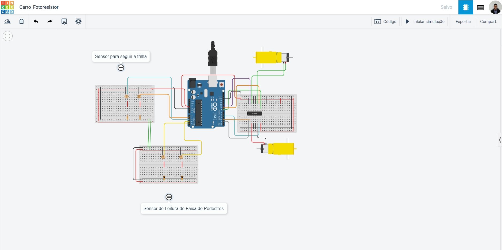
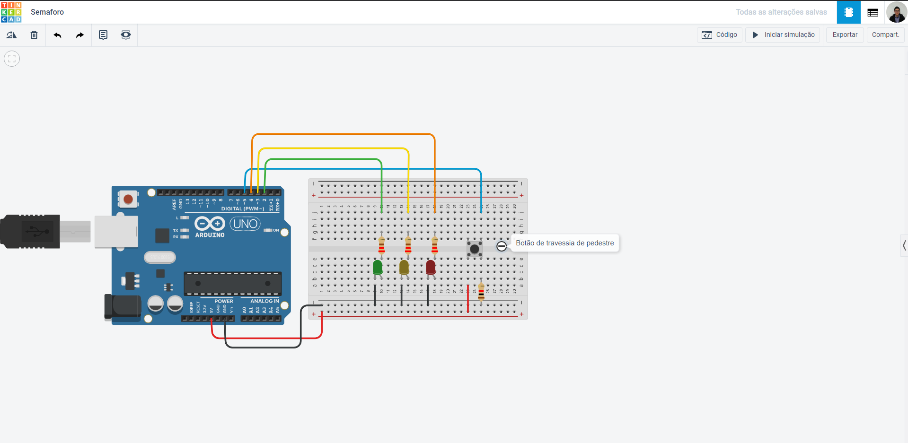

# Stop, Think & Go (Sistemas Distribuidos em IOT)

 
 
 
 
# Apresentação do Projeto

Projeto realizado no 4º Semestre com temática __Sistemas Distribuidos__
 
 
 
 
## Itens utilizados:
1. Arduino UNO
2. HC-05
3. Resistor 220 ohms
4. Resistor 1k ohms
5. LEDs
6. Push button
7. Suporte Bateria 18650 Single
8. Módulo de sensores Infravermelho
9. Ponte H L298N versão mini
10. Motor 3v-6v com caixa de redução
11. Celula de Lítio
12. Step-up MT3608 2A
13. Rodas (impressora 3D)
14. Semáforo (impressora 3D)
15. Roda giratória

__Obs.: Na prototipação alguns itens foram substituidos. Para maiores detalhes de valores e onde encontrar, consultar o arquivo [ITEMS_CUSTOS](./ITEMS_CUSTOS.xlsx)__
 
 
 
 
# Prototipação do Carro

 
 
# Prototipação do Semáforo

 
 
# Link para os protótipos no TinkerCad

[Carro seguidor de trilha, integrado a Rede Bluetooth](https://www.tinkercad.com/things/kfIOXfRxLZz-carrofotoresistor)
 
[Protótipo do Semáforo sinalizador de fases e estados, integrado ao Carrinho Seguidor de Trilhas](https://www.tinkercad.com/things/7cVv6eWKY6D)
