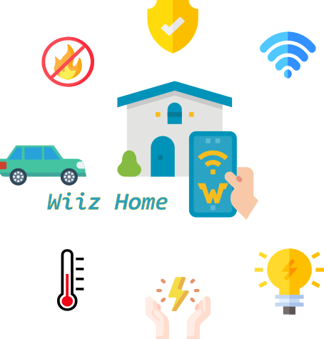
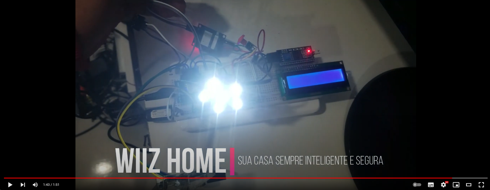
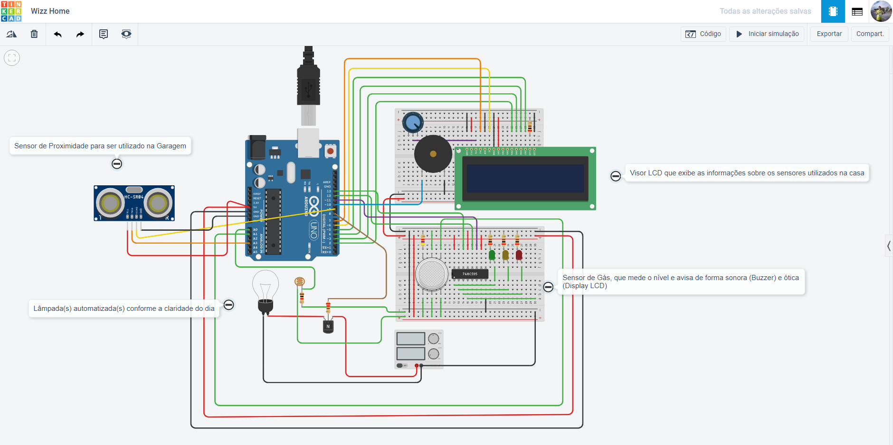

# Wiiz Home - Automação Residencial (Home Automatic)

 
 
 
 
# Apresentação do Projeto

Projeto realizado por mim, no 4º Semestre com temática __Aquisição de Sinais Analógicos__
 
 
 
 
## Itens utilizados:
1. Arduino Uno R3
2. Registrador de deslocamento de oito bits
3. 4.7 kΩ Resistor
4. Verde LED
5. Amarelo LED
6. Vermelho LED
7. 0.2 kΩ Resistor
8. LCD 16 x 2
9. 250 kΩ, Potenciômetro
10. Lâmpada (LEDs)
11. Fotorresistor
12. Transistor NPN (BJT)
13. 14 , 0.5 Fonte de energia
14. 1 kΩ Resistor
15. Piezo
16. Sensor de gás
17. 220 Ω Resistor
18. Sensor de distância ultrassônico

__Obs.: Na prototipação alguns itens foram substituidos. Para maiores detalhes de valores e onde encontrar, consultar o arquivo [Componentes Utilizados](./Componentes_Utilizados.xlsx)__
 
 
 
 
# Prototipação no TinkerCad

